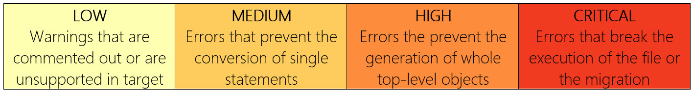

# Issues and Troubleshooting

Conversions of any large quantity of code will likely have a few errors and warnings. Mobilize.Net has been the leading authority on code conversion for 25 years, and trust us, we understand this. When using any of our products, you can count on us to be your partner in resolving any errors you may encounter. Below is a list of common conversion issues that you may see when you perform a conversion with SnowConvert along with a severity level for each. Some suggested solution paths based on the severity level will follow the list of codes. Take a minute to read through the list and the troubleshooting tips to help diagnose some of the error codes you have encountered. If you have a question that cannot be answered here, please reach out! You can post in the [SnowConvert forums](https://forums.mobilize.net/forum/23-snowconvert/) or drop us an email at [support@mobilize.net](mailto:support@mobilize.net). This is a living list, so it will grow and change as SnowConvert evolves. Updates to issue and error handling will appear on this page, and will also appear [in the release notes](http://docs.mobilize.net/SnowConvert/updates.html).

## Error Codes

Here is the list of error codes that exist in SnowConvert. A description of the severity levels and some troubleshooting suggestions will follow this list of codes.

| Code | Description | Severity |
| :--- | :--- | :--- |
| SCEI017 | Error - Collation not supported | LOW |
| SCEI026 | ERROR: DEFAULT CURRENT\_TIME NOT VALID FOR DATA TYPE | LOW |
| SCEI030 | ERROR: GEO-SPATIAL TYPES NOT SUPPORTED | LOW |
| SCEI032 | ERROR: {0} COLUMN NAME NOT SUPPORTED | LOW |
| SCWI020 | Conversion warning - The following value should have some runtime errors in JavaScript. | LOW |
| SCWI021 | WARNING: CONSTRAINT TYPE NOT SUPPORTED | LOW |
| SCWI022 | WARNING: PERFORMANCE REVIEW - CLUSTER BY | LOW |
| SCWI024 | WARNING: TEMPORAL COLUMN NOT SUPPORTED | LOW |
| SCWI025 | WARNING: {0} NOT SUPPORTED | LOW |
| SCWI027 | WARNING:  UPPERCASE NOT SUPPORTED | LOW |
| SCWI028 | WARNING: TIME ZONE NOT SUPPORTED FOR TIME DATA TYPE | LOW |
| SCWI029 | WARNING: BINARY DOES NOT SUPPORT {0} | LOW |
| SCWI031 | WARNING: CHECK STATEMENT NOT SUPPORTED | LOW |
| SCWI033 | WARNING: Column converted from BLOB data type | LOW |
| SCWI034 | WARNING: Column converted from CLOB data type | LOW |
| SCWI035 | WARNING: {0} DATA TYPE "{1}" CONVERTED TO VARCHAR | LOW |
| SCWI037 | WARNING: SET TABLE FUNCTIONALITY NOT SUPPORTED | LOW |
| SCWI038 | WARNING: GLOBAL TEMP TABLE FUNCTIONALITY NOT SUPPORTED | LOW |
| SCWI039 | WARNING: GLOBAL TEMP TABLE TRACE FUNCTIONALITY NOT SUPPORTED | LOW |
| SCWI040 | WARNING: VARIANT COLUMN DOES NOT SUPPORT COLLATION | LOW |
| SCWI041 | WARNING: CONVERTED FROM {0} TO VARCHAR FOR CURRENT\_SESSION DEFAULT | LOW |
| SCWI042 | Conversion Note - Removed next statement, not applicable in Snowflake. | LOW |
| SCWI043 | Conversion Note - The following statement has been commented. | LOW |
| SCWI044 | Conversion Note - Commented out code related with dropping work or error table. | LOW |
| SCWI045 | Conversion warning - Procedure - This statement may be a dynamic sql that could not be recognized and converted | LOW |
| SCCI003 | Conversion issue - Severity Medium - No Transformation rule found for this BTEQ node. | MEDIUM |
| SCCI005 | Conversion issue - Severity Medium - Error executing a conversion rule for a specific sql node in the file {0}. Error message: {1} | MEDIUM |
| SCCI006 | Conversion issue - Severity Medium - No Transformation rule found for this node. | MEDIUM |
| SCCI007 | Conversion issue - Severity Medium - Error executing a conversion rule for a specific bteq node in the file {0}. Error message: {1} | MEDIUM |
| SCCI014 | Conversion issue - Severity Medium - Procedure - A statement cannot be converted | MEDIUM |
| SCCI018 | Conversion issue - Severity Medium - Unexpected end of statement. Please check the original source code. | MEDIUM |
| SCCI019 | Conversion issue - Severity Medium - Unexpected end of statement. Please check the line {0} of original source code. | MEDIUM |
| SCCI023 | Conversion issue - Severity Medium - Exception thrown while converting item: {0}. Line: {1} of file: {2} | MEDIUM |
| SCCI036 | Conversion issue - Severity Medium - '{0}' has recursive references. Forward alias conversion could not be completed | MEDIUM |
| SCCI037 | Conversion issue - Severity Medium - The usage of the .Goto {0} is not supported. | MEDIUM |
| SCWI006 | Warning - Unexpected error when executing transformation assessment in the file {0}. Error message: {1} | MEDIUM |
| SCWI008 | Warning - Could not write the assessment details report file {0}, Error message: {1} | MEDIUM |
| SCWI009 | Warning - Could not write the assessment summary report file {0}. Error message: {1} | MEDIUM |
| SCWI010 | Warning - Could not write the issue report file {0}. Error message: {1} | MEDIUM |
| SCWI011 | Warning - Could not write the assessment report file {0}. Error message: {1} | MEDIUM |
| SCCI004 | Conversion issue - Severity High - Unexpected error while converting the code \n | HIGH |
| SCCI015 | Conversion issue - Severity High - Error executing {0} {1} top level object conversion. | HIGH |
| SCCI016 | Conversion issue - Severity High - Procedure - No transformation rule found for this {0} procedure statement | HIGH |
| SCPI001 | Conversion issue - Severity High - Unrecognized Token. | HIGH |
| SCCI011 | Conversion issue - Severity High - The source file '{0}' had an unexpected transformation error and was not generated.  Check the error log for more information. | CRITICAL |
| SCCI012 | Conversion issue - Severity High - The source file '{0}' had an unexpected transformation error and was not generated. Error message: {1} | CRITICAL |
| SCCI013 | Conversion issue - Severity High - Error writing file '{0}'. {1} | CRITICAL |

How should you troubleshoot each error type? Troubleshooting is not an exact science, especially when it comes to complex code conversion. We’ve given you a description of each of the severity levels and some suggestions on how to handle each error type below.

## Error Severity

Conversion errors happen. For Mobilize.net SnowConvert, errors are put into the following categories:

Regardless of the error severity, step 1 in troubleshooting a conversion is always to check the source code, especially if you receive a large number of errors. Ensure that it compiles in Teradata first. Often times a misplaced quote or parenthesis could lead to an entire file not converting correctly.

Beyond that, please review the severity levels and information below. It’s worth reiterating that if you have a conversion that did not succeed, please reach out! We would love to hear from you.

Let’s look at each severity level and see what we recommend as next steps.

### Low

Low level errors are not actually errors. They are considered warnings. In other words, we are confident the code as a whole was converted, and it will compile in Snowflake. However, some things may look different. For example, Code SCWI037 changes a CREATE SET TABLE statement to a CREATE TABLE statement. An issue will be logged in the issues report, and a comment will be placed above the line where the original CREATE SET TABLE statement was written. The code was successfully converted, but there as a change made. The reason you would create a SET table in Teradata \[link\] not only doesn’t exist in Snowflake, but it is completely unnecessary to Snowflake’s architecture. We would still recommend that you take a look at the output to ensure that the standard table is the correct output for the day. The only recommended steps are to check the output when running the code, and ensure it compiles into Snowflake correctly. We are confident that it will, but would recommend that you still check on it.

### **Medium**

Medium level errors indicate that a small piece of a object did not convert correctly, such as a line of code in a table statement or a macro/procedure. Check the issues report to find the exact location of the error. Depending on the context, that line or statement may not be necessary or ithere may be an issue with the source code. There are some terms or elements that SnowConvert does not yet recognize, even though the tool receives regular updates and version releases. For these type of errors, the output is usually a commented out version of the input. Check the line in the output, and determine if that will need a manual conversion or if it can be removed. If you are not sure what to do next, reach out! 

### **High**

A high level error indicates that an entire object could not be converted. This will require you to evaluate the object in question \(procedure, macro, join, etc.\) and evaluate the source code. Most high level conversion errors indicate there is information that simply did not make sense. The vast majority are resolved by updating the source code no the output code. The remainder usually come from a term that SnowConvert does not yet recognize. Post in the forums or send us an email so we can partner with you in solving this problem. 

### **Critical**

Critical errors are exceptionally rare \(less than 1% of objects error codes\), but they do happen. A critical error will most likely cause SnowConvert to fail and a crash report screen to come up. Please give as much information as you can in the crash report screen so we can diagnose the issue. If a crash report screen does not appear, please check the issues report focusing on the critical errors. Though the program completely converted the code, the presence of a critical errors could indicate there are other unrecognized errors as well. Hopefully and mot likely, you will not find yourself in this situation. IF you do, check the source code again, and let us know. 

For some general troubleshooting suggestions, see below the list of error messages.

## Need more support?

As has been mentioned previously in this article, please reach out to us if you need more support. Mobilize.Net wants to be your partner in the conversion process, so let us know how we can help. You can email us at [support@mobilize.net](mailto:support@mobilize.net) or [post a message to our forums](https://forums.mobilize.net/forum/23-snowconvert/). If you have a contract for support with Mobilize.Net, reach out to your sales engineer and they can direct your support needs.

