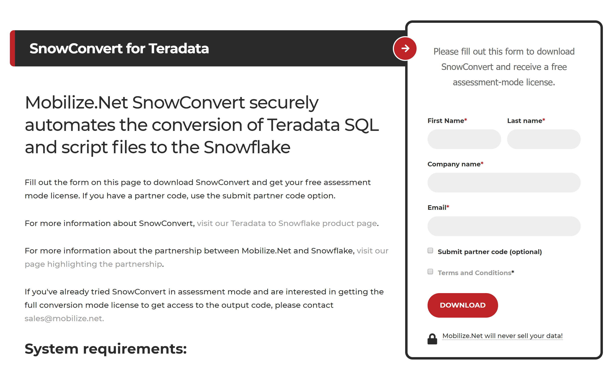
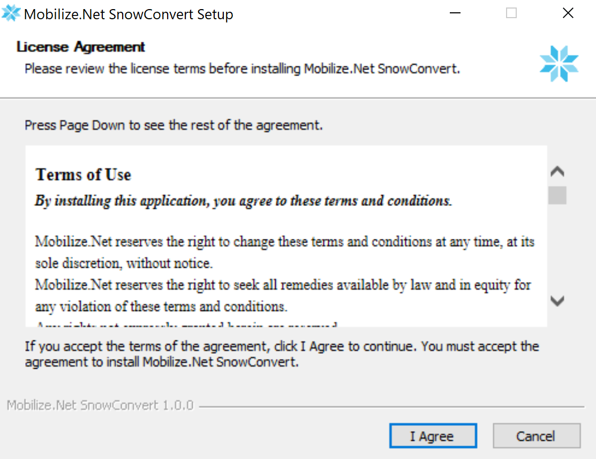

# Download, Install, and License Information

## Download

Getting up and running with Mobilize.Net SnowConvert is quick and easy. You can download SnowConvert from the following link:

[https://www.mobilize.net/snowconvert](https://www.mobilize.net/snowconvert)

On that page you will find a form that you can fill out to request the tool. 

The tool is available in three modes: assessment mode, trial mode, and full conversion mode. \(See [Licenses](https://bcarver.gitbook.io/snowconvert-documentation/untitled/~/settings/advanced#how-to-request-a-license) at the end of this page to learn more about the different modes.\) To download in assessment mode, all you need to do is fill out the form. If you are going to download in trial or full conversion mode, you will need a partner code. You can reach out to [sales@mobilize.net](mailto:sales@mobilize.net) to get access to those licenses. 

Note that when downloading the form, you will have the check the box for Terms and Conditions. Once you click "DOWNLOAD", the installation package will start downloading. When finished, click on the downloaded .exe file to start the installer. 

The download is ~ 100MB, and setup takes place in a matter of minutes. Below are the system requirements for downloading the tool:

### System Requirements

* Windows 10
* .NET Runtime 4.6.2 or greater \(available by default starting from Windows 10 - 1607\)
* 4GB of RAM \(recommended\)

## Installation

The installation for Mobilize.Net SnowConvert should only take a few minutes. If you've followed the instruction above, you should have downloaded an .exe file that Once you open the .exe file, the welcome screen will come up. 

On the following link you can find and download the Mobilize SnowConvert Tool [https://mobilize.net/SnowConvert](https://mobilize.net/SnowConvert)

### Step 1: Download

Once you are in our website \([https://mobilize.net/SnowConvert](https://mobilize.net/SnowConvert)\) you will be asked to fill out the form to download the tool and get your license key. The download will automatically start after submitting the form, you will receive an email with the license key to activate the conversion tool.

### Step 2: Execute the installer

1. To execute the installer click on the downloaded exe file. 
2. Then in the next screen, click on install button. 
3. The installer will setup all the required files in your machine 
4. Once the installation finishes the tool will be executed inmediatly after you click on Finish. 

### Step 3: Input license \(email key reception\)

A valid license key is required to execute any kind of conversion, you will be asked for it on the first start.

After you fill to the SnowConvert download form, you will receive an email \(the email address that you used in the registration form\) from Mobilize \(studio@mobilize.net\) containing the SnowConvert License Key.

The license key will allow you to activate the product to execute conversions and receive version updates.

## Licenses

As mentioned before your SnowConvert license key is required to activate your product and convert your source code, but there are some important differences that you may know about our licensing mechanisms.

### Types of licenses

For SnowConvert we provide two different types of licenses:

* Metered
* Date

Bellow you can find more detail about each type of license.

| Type | Detail |
| :--- | :--- |
| Metered | With this license type you will be able to execute the tool converting a defined amount of lines of code. As default our line limit licenses has 1000 lines of code available to convert your source code. |
| Date | This type of license will allow you to convert any quantity of source code without any limitations beyond the date. As default our Promo Code licenses has 90 days available to convert your source code. |

### How to request a license

#### First time license

The simplest way to get a SnowConvert license is filling out the form that you can find here: 

After that you will receive an email \(the email address that you used in the registration form\) from Mobilize \([studio@mobilize.net](mailto:studio@mobilize.net)\) containing the SnowConvert License Key. 

#### License renewal

To request a license renewal contact us at [support@mobilize.net](mailto:support@mobilize.net) and our team will contact you to proceed with the renewal process \(could require a purchase\).

